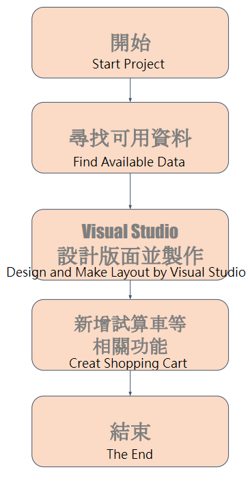

# DrinkShop
Xamarin入門課程專題(Introduction to Xamarin.Forms)

**DrinkShop**  
  
以範例Xaminals延伸製作四間飲料店點單、客製化系統，並使用Navigation將客製化價錢導向試算頁面。  
Extending from the example Xaminals, four beverage shops' ordering systems were created and customized, using Navigation to direct customized pricing to the calculation page.  

    
↑程式架構(Software Architecture)  

     
↑手機模擬客製化、試算畫面(Customized and calculation screens simulated on mobile devices.)  

Reference example：https://github.com/xamarin/xamarin-forms-samples/tree/main/UserInterface/Xaminals
